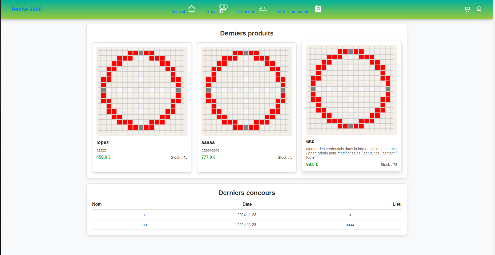
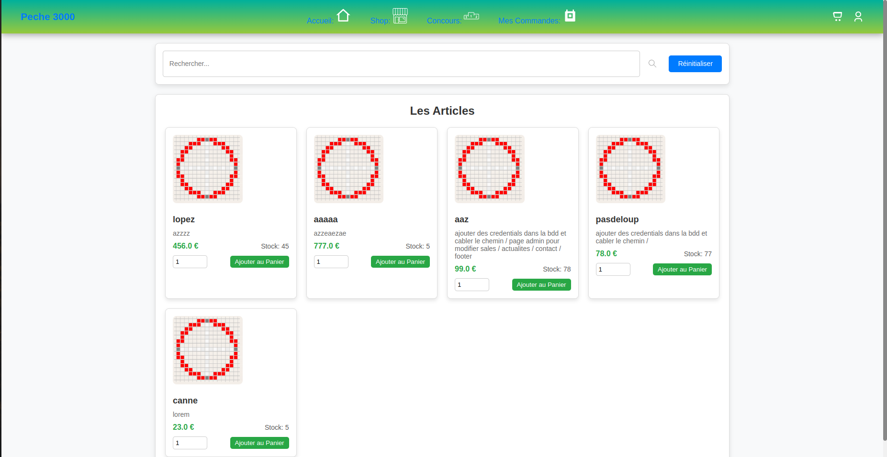
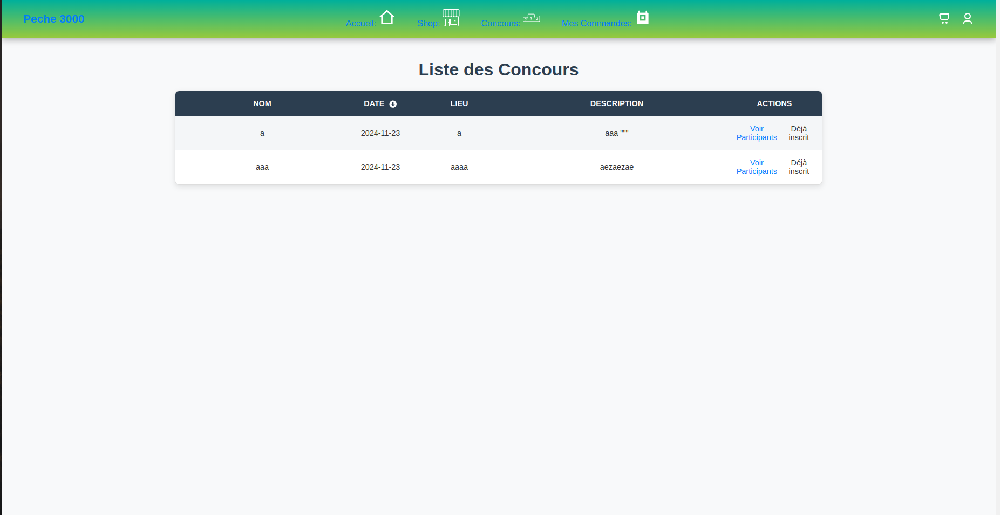
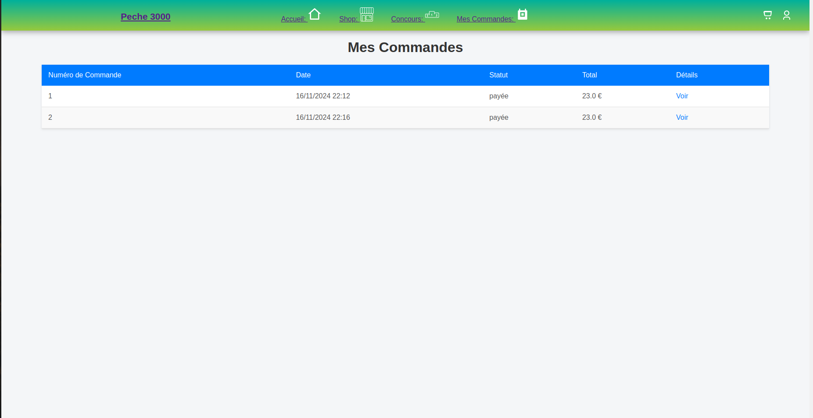
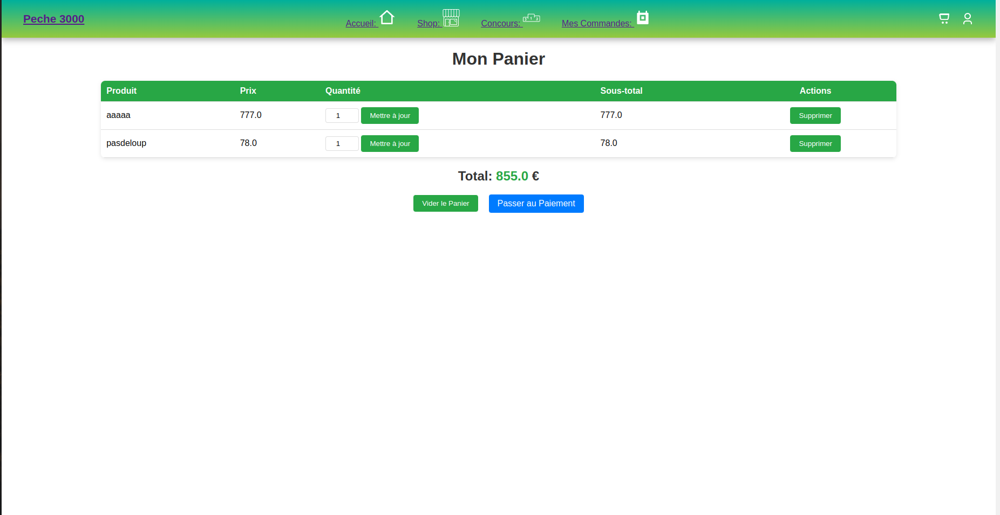
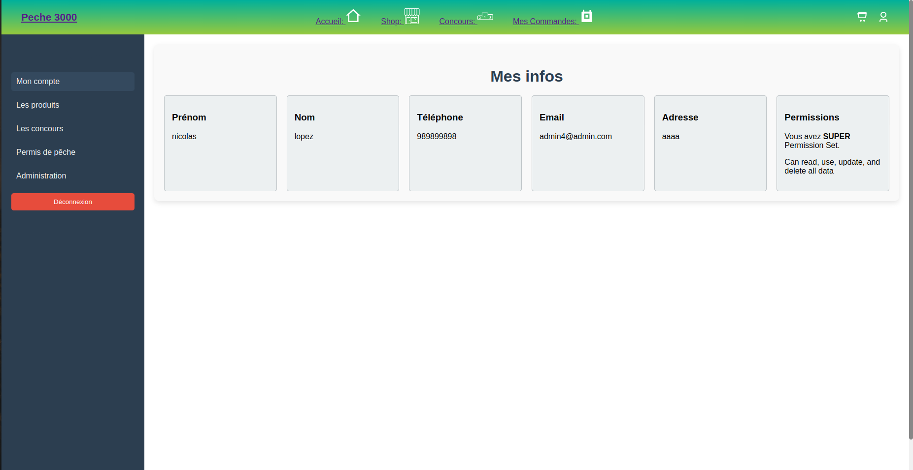
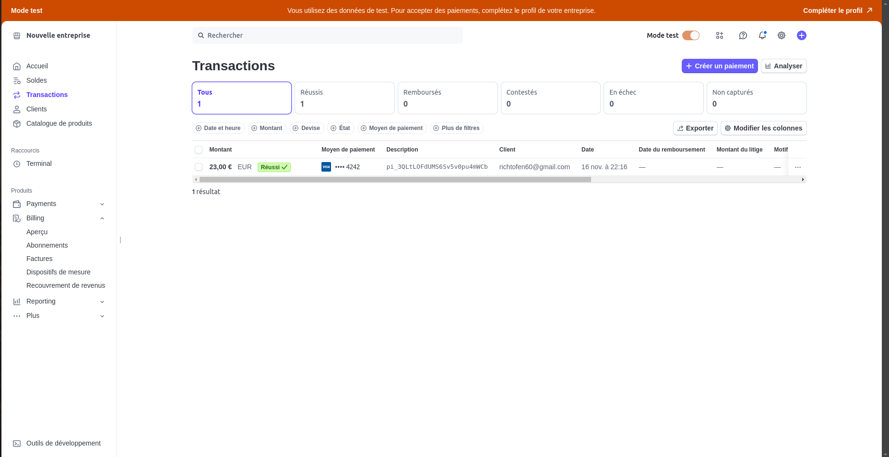
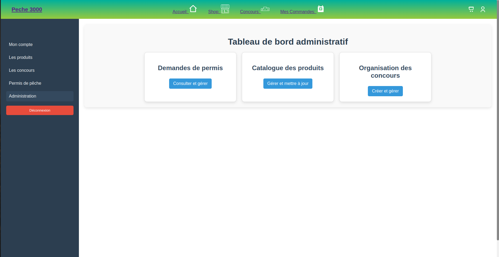

# 🐟 Peche3000 - Gestion de Magasin et Services de Pêche

Bienvenue sur **Peche3000**, une application web dédiée à la gestion d'un magasin d'articles de pêche et de ses services annexes (concours, permis, etc.).

---

## **📂 Structure des Fichiers**

```
templates/
├── _parts/
│   └── _header.html
├── admin/
│   ├── concours/
│   │   ├── ajouter_concours.html
│   │   ├── liste.html
│   │   └── modifier_concours.html
│   ├── produits/
│   │   ├── ajouter_produit.html
│   │   ├── liste_produits.html
│   │   └── modifier_produit.html
├── boutique/
│   ├── detail.html
│   └── liste.html
├── concours/
│   ├── liste.html
│   └── participants.html
├── permis/
│   ├── demande.html
│   └── liste.html
├── profil/
│   ├── profil.html
│   ├── home.html
│   ├── login.html
│   ├── panier.html
│   └── register.html
application.properties
```

## **📸 Aperçu des Pages**

### **Page d'Accueil**


### **Page de Boutique**


### **Page de Concours**


### **Page de Commandes**


### **Page du Pannier**


### **Page de Profil**


### **Confirmation de paiement sur stripe**


### **BACKOFFICE**



---

## **🛠️ Développement et Documentation**

### **Pré-Setup**
- Création du dictionnaire des données.
- Modélisation MCD et MLD.

### **Setup**
- Création du dépôt Git.
- Initialisation du projet avec les dépendances nécessaires.
- Configuration de la base de données.
  - **SDK utilisé** : Amazon Corretto 17.0.13.

### **Backend**
- Création des entités et enums.
- Création des services, repositories et controllers.
- Implémentation des fonctionnalités de connexion et d'inscription.

### **Frontend**
- Conception des templates (HTML).
- Ajout du style (CSS).

### **Navigation**
- Mise en place des routes pour l'utilisateur et l'admin.

### **Pages Restantes**
- Customisation et finalisation avant la date limite : **18/11/2024**.

---

## **🎯 Création du Projet**

### **GroupID et ArtifactID**
- **GroupID** : `com.magasinpeche`
- **ArtifactID** : `SpringBootPeche3000LN`

### **Configuration de la Base de Données**
1. Accédez à MySQL :
   ```bash
   sudo mysql -u root -p
   ```
2. Créez la base de données :
   ```sql
   CREATE DATABASE DBMagasinPeche;
   ```
3. Créez un utilisateur :
   ```sql
   CREATE USER 'user'@'localhost' IDENTIFIED BY 'admin';
   ```
4. Attribuez les privilèges :
   ```sql
   GRANT ALL PRIVILEGES ON DBMagasinPeche.* TO 'user'@'localhost';
   FLUSH PRIVILEGES;
   ```

---

## **📦 Dépendances Maven**
Les dépendances utilisées dans le projet sont :
- `spring-boot-starter-data-jpa`
- `spring-boot-starter-security`
- `spring-boot-starter-thymeleaf`
- `spring-boot-starter-web`
- `thymeleaf-extras-springsecurity6`
- `mariadb-java-client`
- `spring-boot-starter-test`
- `spring-security-test`
- `spring-boot-devtools`

### **Installation Maven**
1. Installez Maven :
   ```bash
   sudo apt install maven
   ```
2. Vérifiez l'installation :
   ```bash
   mvn -v
   ```

---

## **🗂️ Ressources**

### **Dictionnaire des Données (Principales Entités)**

#### **Produit**
- `id` : Identifiant unique.
- `nom` : Nom du produit.
- `description` : Description du produit.
- `prix` : Prix du produit.
- `stock` : Quantité disponible.
- `categorie` : Catégorie (ex : cannes à pêche, appâts).
- `imageUrl` : URL de l'image.
- `dateCreation` : Date de création.

#### **Client**
- `id` : Identifiant unique.
- `nom` : Nom.
- `prenom` : Prénom.
- `email` : Adresse email.
- `adresse` : Adresse postale.
- `telephone` : Numéro de téléphone.
- `historiqueCommandes` : Liste des commandes passées.

#### **Commande**
- `id` : Identifiant unique.
- `client` : Référence au client.
- `produits` : Liste des produits commandés.
- `dateCommande` : Date de la commande.
- `total` : Montant total.
- `statut` : Statut (en attente, expédiée, livrée).

#### **Permis de Pêche**
- `id` : Identifiant unique.
- `client` : Référence au client.
- `statut` : Statut de la demande (en attente, approuvé, rejeté).
- `dateDemande` : Date de la demande.

#### **Concours**
- `id` : Identifiant unique.
- `nom` : Nom du concours.
- `date` : Date du concours.
- `lieu` : Lieu.
- `description` : Description.
- `participants` : Liste des participants (référence au client).

### **Relations**
- Un **Client** peut :
  - Passer plusieurs **Commandes**.
  - Faire plusieurs demandes de **Permis**.
  - Participer à plusieurs **Concours**.
- Une **Commande** peut contenir plusieurs **Produits**.

---

## **📅 Objectif Final**
Créer une application fonctionnelle et intuitive avant le **18 novembre 2024**.

---

# TODO LIST :

* Permis: Notification par email une fois la demande traitée. NON il faut envoyer le mail

* Concours: Envoi de confirmation et suivi de la participation. 50% il faut envoyer le mail

* Gestion des informations personnelles (nom, prénom, adresse, téléphone, etc.). probleme de doublons email et resetdurole

* Visualisation des statistiques du magasin (ventes, inscriptions aux concours, demandes de permis). 90% ajouter un graph de ventes maybe

* **Gestion de la boutique en ligne NO**
  - Navigation par catégorie de produits.
  - Filtrage et recherche des articles.